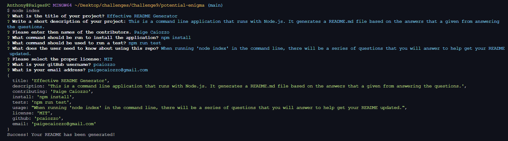
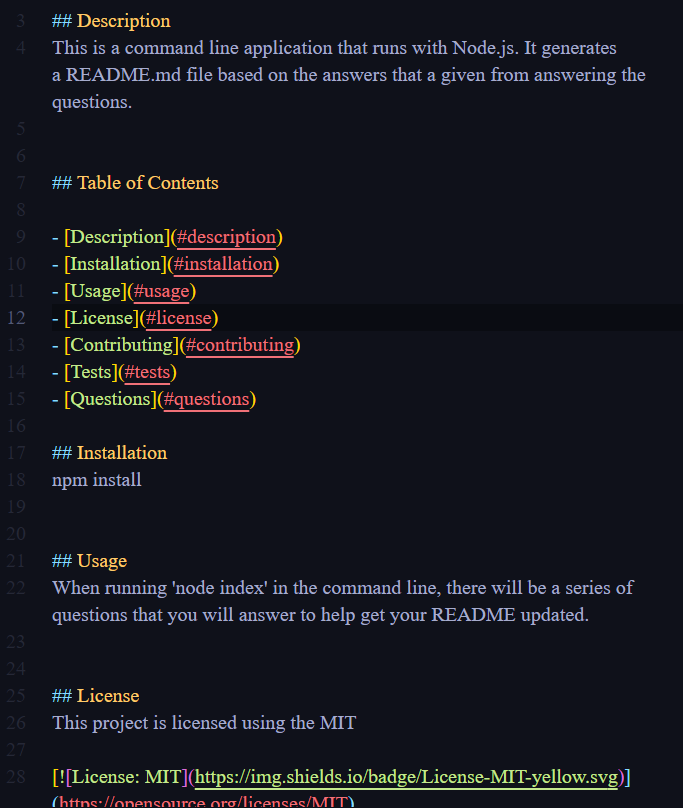

# Effective README Generator

## Description
This is a command line application that runs with Node.js. It generates a README.md file based on the answers provided.

## Table of Contents

- [Description](#description)
- [Installation](#installation)
- [Usage](#usage)
- [License](#license)
- [Contributing](#contributing)
- [Tests](#tests)
- [Questions](#questions)

## Installation
npm install

## Usage
When running 'node index' in the command line, there will be a series of questions that you will answer to help with getting your README updated.
 ### Click [here](https://drive.google.com/file/d/1szJ5TdTqDT7cdF2rlYjSu3WEPQKEx1P0/view) to watch a live walkthrough of how it works.

## License
This project is licensed using the MIT 

## Contributing
Paige Caiozzo

## Tests
npm run test

## Questions
If you have any questions, contact me!

- GitHub: [GitHub!](https://github.com/pcaiozzo)
- Email:  paigecaiozzo@gmail.com

